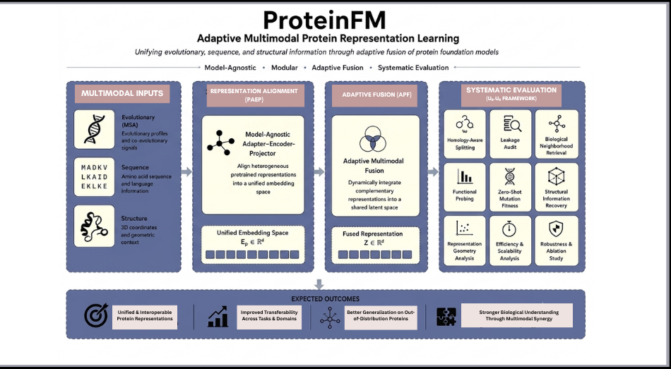

# Priyam Pandey

**BS–MS @ IISER Thiruvananthapuram**  
Multimodal Representation Learning | Geometric Deep Learning | Protein AI

---

## Research Focus

Research in **multimodal and geometric representation learning for
biological systems**, with an emphasis on learning **structured,
generalizable representations** from heterogeneous biological data.

My current research focuses on **protein foundation models, 3D
biological representation learning, and adaptive multimodal fusion**.

**Trajectory**  
Multimodal Representation Learning → 3D Geometric Deep Learning → Protein Foundation Models

---

## Featured Projects

### 1. ProteinFM — Adaptive Multimodal Protein Foundation Models *(Ongoing)*

A research framework for studying adaptive integration of heterogeneous
protein foundation-model representations across **evolutionary,
sequence, and structural information**.

Current research directions include:

- **PAEP** — ProteinFM Adapter–Encoder–Projector framework for
  interoperable protein representations.
- **APF** — Adaptive Protein Fusion for integrating complementary
  biological representations.
- **U₀–U₈** — systematic evaluation of learned protein representations
  across biological and representational dimensions.

The broader goal is to investigate how heterogeneous protein
representations can be aligned, adaptively integrated, and evaluated
for biological generalization.

→ [Project Repository](https://github.com/priyam-pandey-r/ProteinFM)

---

### 2. Multi-View Neuronal Morphology

Multi-view representation learning for **3D biological morphology**
across graph, point-cloud, and voxel representations.

Developed **Morphogenesis Fusion** for hierarchical integration of
complementary geometric and topological representations.

**Status:** First-author manuscript under review in *Neurocomputing*.

→ [Project Repository](https://github.com/priyam-pandey-r/multiview-morphology-representation-learning)

---

### 3. Confidence-Gated Multimodal Representation Learning

Privacy-preserving behavior recognition using complementary **thermal
and pose modalities**.

Developed **Confidence-Gated Cross-Attention (CGCA)** and
**Cross-Gated Hierarchical Cross-Attention (CGHCA)** for
confidence-aware multimodal representation fusion.

**Status:** First-author publication in *Knowledge-Based Systems*,
2026.

→ [Project Repository](https://github.com/priyam-pandey-r/multimodal-har-thermal-pose-framework)

---

## Research Trajectory

**Multimodal Representation Learning**  
↓  
**Confidence-Aware Multimodal Fusion**  
↓  
**3D Geometric Representation Learning**  
↓  
**Protein Foundation Models**

---

## Current Research

### Protein Foundation Models

Investigating multimodal protein representations across evolutionary,
sequence, and structural information, with an emphasis on adaptive
fusion and systematic representation evaluation.

### 3D Geometric Biological Learning

Developing representation-learning methods for biological structures
using complementary geometric and topological representations.

### Adaptive Multimodal Learning

Studying how heterogeneous biological modalities can be aligned and
adaptively integrated according to their complementary information and
reliability.

---

## Research Status

- **ProteinFM:** Active research / under development
- **Neuronal Morphology:** First-author manuscript under review in
  *Neurocomputing*
- **Confidence-Gated Multimodal Learning:** First-author publication in
  *Knowledge-Based Systems*, 2026

---

## Note

Some projects are under active research. Full implementations,
technical details, and unreleased experimental results are not publicly
available while the research is ongoing.

Implementation details can be discussed upon request.