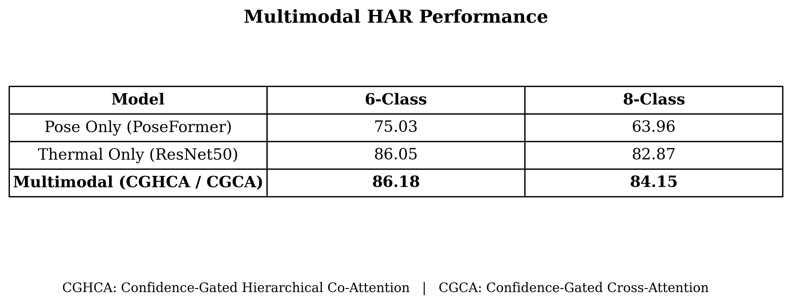

---

# Priyam Pandey

**BS–MS @ IISER Thiruvananthapuram**
Multimodal Representation Learning | Bio-AI

---

## Research Focus

I work on **multimodal representation learning for biological systems**, with an emphasis on learning structured and generalizable embeddings from complex, heterogeneous data.

**Trajectory**
Representation Learning → Multimodal Systems → Single-Cell → Bio-AI

---

## Projects

### 1. Multimodal Human Activity Recognition (Thermal + Pose)

**Problem**
Conventional HAR relies on RGB data, raising **privacy concerns** and failing under low-visibility conditions.
Thermal and pose provide complementary **privacy-preserving alternatives**, but their integration remains underexplored.

---

**Approach**

* Established a **controlled multimodal benchmarking framework** on an extended thermal–pose dataset
* Identified stable unimodal backbones (**PoseFormer, ResNet/EfficientFormer**) through multi-seed evaluation
* Designed **confidence-aware fusion mechanisms**:

  * CGCA (Confidence-Gated Cross-Attention)
  * CGHCA (Confidence-Gated Hierarchical Co-Attention)
* Explicitly modeled **modality reliability** to regulate cross-modal interaction

---

**Results**

* Consistent improvement over unimodal baselines with **low variance across seeds**

---

**Contribution**

* First **systematic benchmark** for thermal–pose multimodal HAR
* Introduced **confidence-aware attention** for reliability-controlled fusion
* Demonstrated that **structured multimodal interaction > deterministic fusion**
* Established a **reproducible evaluation protocol** for privacy-preserving HAR

---

### 2. Multi-View Representation Learning for Neuronal Morphology

**Problem**
Single-view representations impose a **structural bottleneck**, as each representation captures only partial aspects of neuronal morphology. Graph, point cloud, and voxel views individually fail to jointly encode topology, fine-scale geometry, and global spatial organization.

---

**Approach**

* Multi-view modeling using complementary representations:
  graph (topology), point cloud (geometry), voxel (volume)
* Unified embedding framework for consistent representation learning
* Structured fusion across modalities
* Proposed **Morphogenesis Fusion**, a biologically inspired hierarchical fusion mechanism:
  topology → geometry → volume

---

**Results**

* Multi-view models consistently outperform the strongest uni-view baselines across tasks
* Significant improvements in fine-grained classification (cell type)
* Gains persist under frozen encoder fusion, indicating **true representational complementarity**

---

**Contribution**
Demonstrates that **complementary structural representations encode distinct biological signals**, and that **structure-aware fusion improves neuronal morphology representation learning**.

---

### 3. Multimodal Single-Cell Representation Learning *(Ongoing)*

**Goal**
Learn dataset-invariant multimodal embeddings across RNA, ATAC, and protein.

**Approach**

* Modality-specific encoders
* Cross-modal alignment via contrastive learning
* Attention-based fusion into a shared representation

**Direction**
Toward scalable and generalizable biological representation learning systems.

---

## Research Trajectory

Morphology → Single-cell → Multi-omics → Biological Foundation Models

---

## Status

* Multimodal HAR: **paper under review (Q1 journal)**
* Morphology: **manuscript prepared**
* Single-cell: **ongoing research**

---

## Note

Full code is not public due to ongoing research submissions.
Implementation details can be discussed upon request.

--