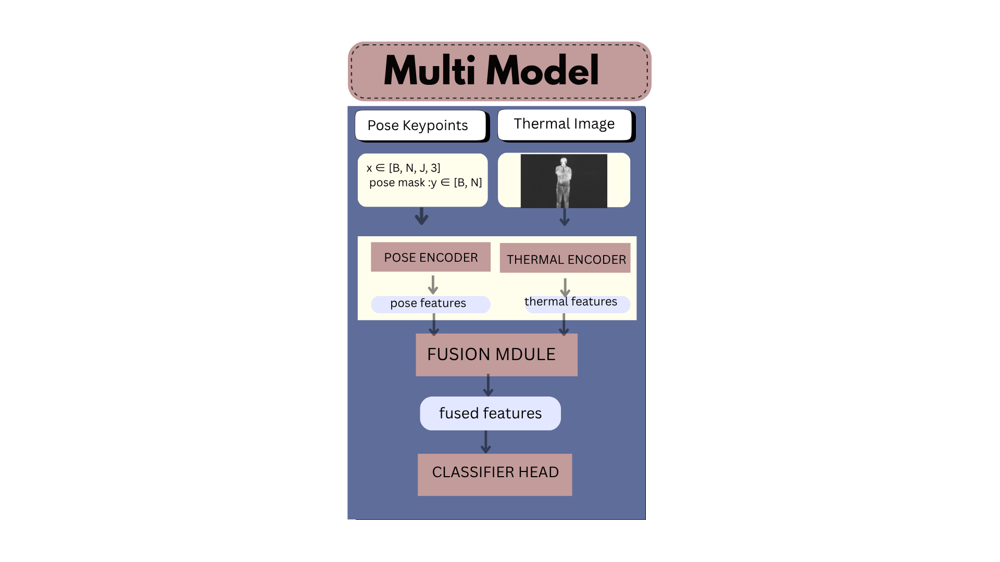
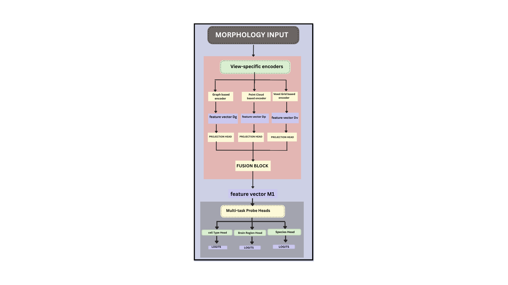

# Priyam Pandey

**BS–MS @ IISER Thiruvananthapuram**  
Multimodal Representation Learning | Bio-AI  

---

## Research Focus

Multimodal representation learning for biological systems, with an emphasis on learning **structured and generalizable embeddings** from complex, heterogeneous data.

**Trajectory**  
Representation Learning → Multimodal → Single-Cell → Bio-AI  

---

## Featured Projects

### 1. Multimodal HAR (Thermal + Pose)

Privacy-preserving activity recognition using thermal and pose signals.  
Proposed **confidence-aware fusion (CGCA, CGHCA)** for reliability modeling.  
Achieved **86.18% / 84.15%**, outperforming strong unimodal baselines.

→ [Project Repository](https://github.com/priyam-pandey-r/multimodal-har-thermal-pose-framework)

---

### 2. Multi-View Neuronal Morphology

Multi-view representation learning across graph, point, and voxel modalities.  
Proposed **Morphogenesis Fusion** for structured hierarchical integration.  
Demonstrated consistent gains over uni-view baselines.

→ [Project Repository](https://github.com/priyam-pandey-r/multiview-morphology-representation-learning)

---

### 3. Multimodal Single-Cell Representation Learning *(Ongoing)*

Learning dataset-invariant embeddings across RNA, ATAC, and protein.  
Focused on contrastive alignment and scalable multimodal integration.

→ [Project Repository](https://github.com/priyam-pandey-r/singlecell-multimodal-representation-learning)

---

## Research Trajectory

Morphology → Single-cell → Multi-omics → Biological Foundation Models  

---

## Status

- Multimodal HAR: **paper under review (Q1 journal)**  
- Morphology: **manuscript prepared**  
- Single-cell: **ongoing research**  

---

## Note

Full code is not public due to ongoing research submissions.  
Implementation details can be discussed upon request.